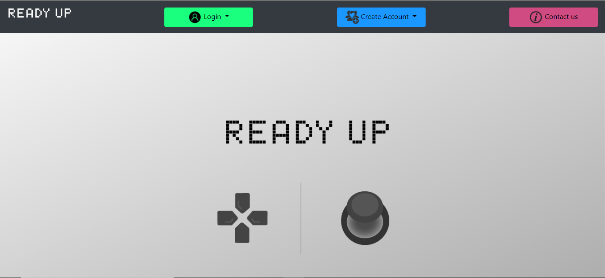

# Project Name
Ready Up!

## Description
Ready Up is the premier LFG esque application for gamers. Ready Up will allow gamers a way to sync up with one another on todays hottest games. 

## Motivation
Gamers today don't always want to rely on in game matchmaking and instead want ways to meet other gamers that have their similar skill or rank. Ready Up sets out to offer gamers a way to do just that by haveing them create an account and join a queue of the games offered and then give them the option to join others seeking the same. 

## Results
Once gamers create an account on Ready Up, they can then join a queue of the available games to be matched with. They can also switch between queues, edit their profile or visit the contact page to view various Ready Up social pages, send an email or join the discord server and chat with other gamers.

## Team Efforts
In managing this project we delegated out who would managed the repo, worked together on merges but also created a KanBan board with user stories and each developer would pull the story they wanted to work on.

## Individual Responsibilities.
We are a team of four developers who contributed the following to this project:

Cameron Wilson - Managed the GitHub repo, created landing and contact pages, css sytlying, helped create logic for matchmaking, helped on presentation and readme, added discord server chat functionality.

Jordan McCollam - Created the majority of the backend logic using JavaScript for authentication, login/logout functionality, logic for the gamers being able to move between queues, created Data Base, helped create logic for matchmaking.

Jacob Hines - Created the background and logo, created the Queue page, image guru and styling, helped on presentation, demo video.

Ewin Tucker - Helped with css sytling 

### Challenges
Getting matchmaking prompts to work when multiple players are in the same queue.

## Improvements
We will look to incorporate a lot more games into the queue spanning across all genres. 
Adding in real time invites.
Add a way to auto link users discorc usernames into their profile to enhance the discord chat feature.

## Demo
